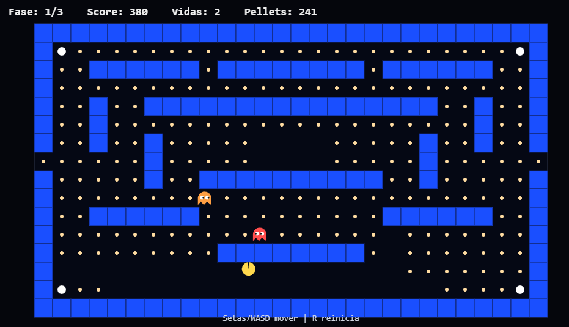

### Preview

> #### Level 1
 <br />

### Salvar no git

> * adicionar na area de stage
 ```
 git add .
 ```

> * adicionar de commit rotuvo do save
```
git commit -m updated
```
 
> * adicionar guarda na nuvem do git
```
git push
```
 